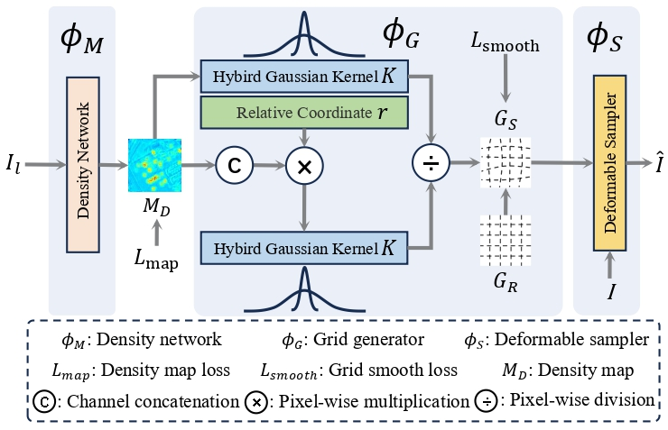
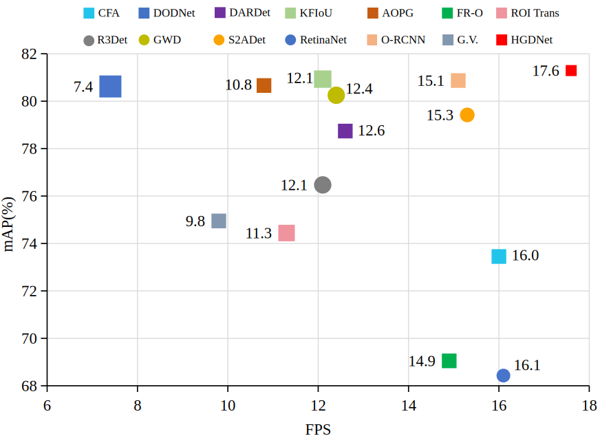
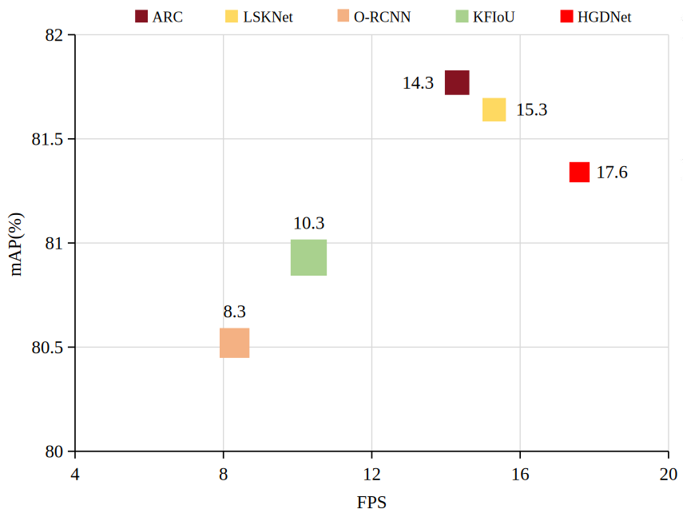
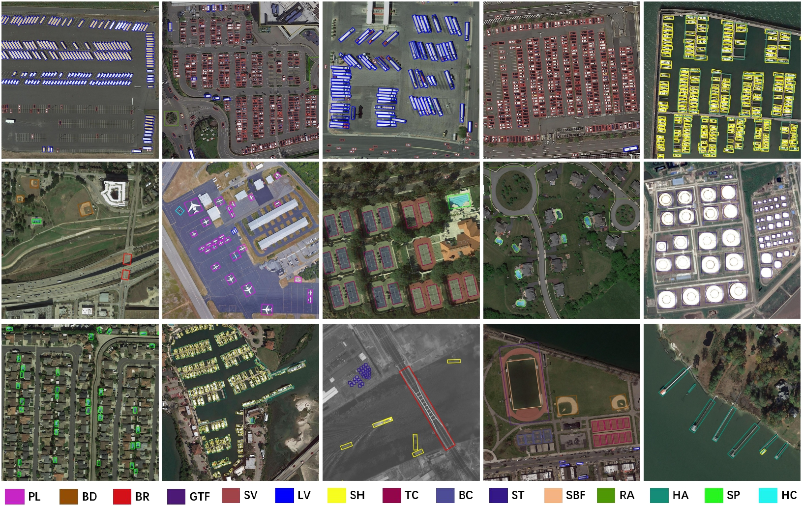

# HGDNet-TPAMI2025

**Hybrid Gaussian Deformation for Efficient Remote Sensing Object Detection**

## Abstract

Large-scale high-resolution remote sensing images (LSHR) are increasingly adopted for object detection since they capture finer details. However, LSHR imposes a substantial computational cost. Existing methods explore lightweight backbones and advanced oriented bounding box regression mechanisms. Nevertheless, they still rely on high-resolution inputs to maintain detection accuracy. 

We observe that LSHR comprises extensive background areas that can be compressed to reduce unnecessary computation, while object regions contain details that can be reserved to improve detection accuracy. Thus, we propose a hybrid Gaussian deformation module that dynamically adjusts the sampling density at each location based on its relevance to the detection task, i.e., high-density sampling preserves more object regions and better retains detailed features, while low-density sampling diminishes the background proportion.

Further, we introduce a bilateral deform-uniform detection framework to exploit the potential of the deformed sampled low-resolution images and original high-resolution images. Specifically, a deformed deep backbone takes the deformed sampled images as inputs to produce high-level semantic information, and a uniform shallow backbone takes the original high-resolution images as inputs to generate precise spatial location information. Moreover, we incorporate a deformation-aware feature registration module that calibrates the spatial information of deformed features, preventing regression degenerate solutions while maintaining feature activation. Subsequently, we introduce a feature relationship interaction fusion module to balance the contributions of features from both deformed and uniform backbones.

Comprehensive experiments on three challenging datasets show that our method achieves superior performance compared with state-of-the-art methods.

## Images

Below are visual representations that further elaborate our methodology and results:

## Code and Checkpoints

The code and checkpoint will be released soon.
